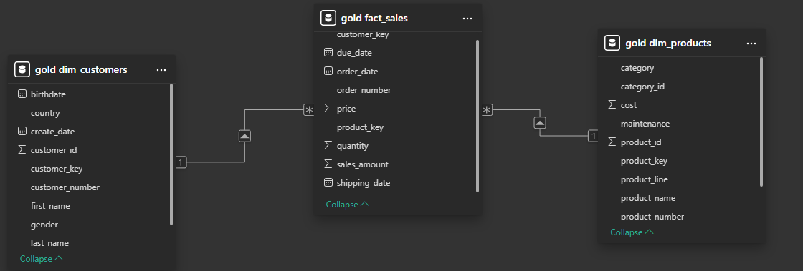

# **Data Warehouse Project**
This project demonstrates a comprehensive data warehousing and analytics solution, from building a data warehouse to generating actionable insights. Designed as a portfolio project, it highlights industry best practices in data engineering and analytics.

---

# 📖 **Project Overview** 
This project involves:

1. **Data Architecture:** Designing a Modern Data Warehouse Using Medallion Architecture Bronze, Silver, and Gold layers.
2. **ETL Pipelines:** Extracting, transforming, and loading data from source systems into the warehouse.
3. **Data Modeling:** Developing fact and dimension tables optimized for analytical queries.
4. **Analytics & Reporting:** Creating PowerBI based dashboards for actionable insights.

---

# 🏗️ **Data Architecture**
The data architecture for this project follows Medallion Architecture Bronze, Silver, and Gold layers:

1. **Bronze Layer:** Stores raw data as-is from the source systems. Data is ingested from CSV Files into SQL Server Database.
2. **Silver Layer:** This layer includes data cleansing, standardization, and normalization processes to prepare data for analysis.
3. **Gold Layer:** Houses business-ready data modeled into a star schema required for reporting and analytics.

---

# **Data Model**

The Data model is designed using a star schema with a central fact table and connected dimension tables using one-to-many relationships. This structure allows efficient querying for analytics and Power BI Dashboards.

---

# **PowerBI Dashboard**

This dashboard provides a high-level view of overall sales performance. Displaying key KPIs, sales over time, and as to what might explain the sudden drop in sales.

**Key Insights:**  
- Sales dropped off as the bike category was no longer being sold or ordered.
- Sales were close to the percentile before december 2013 fro the past 6 months.
- America and Australia being the most popular regions for sales.

